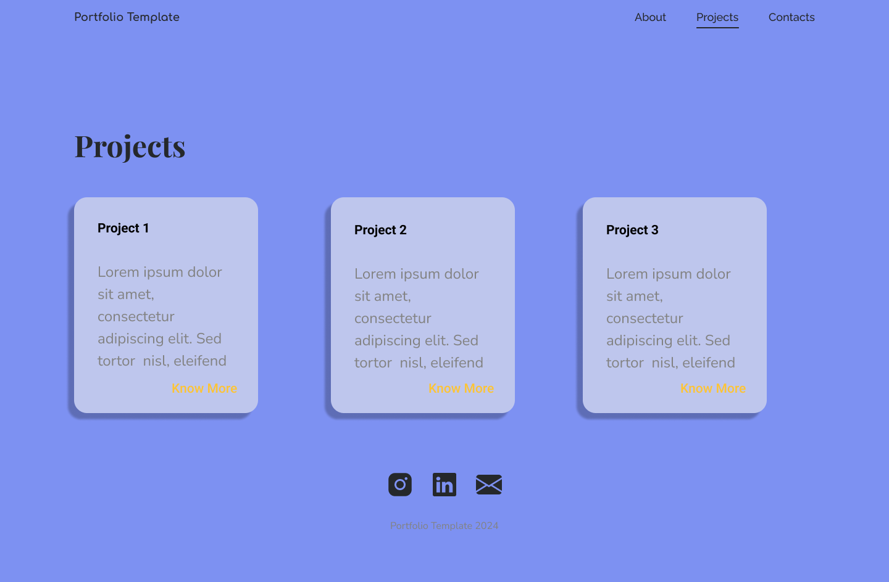
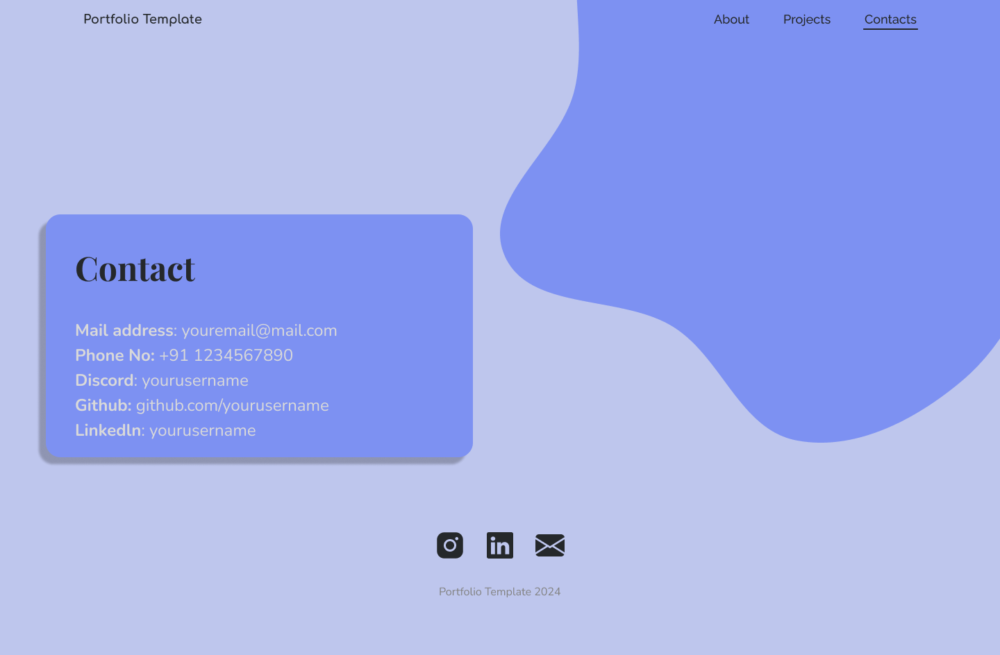

# 🌟 Portfolio Website Template

Welcome to personal portfolio website template 🎨! This project is a work-in-progress, and my goal is to build a visually stunning and functional portfolio by the end of this semester. Below are some sneak peeks of the final vision:





## 💻 Tech Stack

- **HTML**
- **CSS**

## 🎯 Goal

By the end of the semester, I aim to have a fully functional and responsive portfolio website to showcase my work. 

I also plan to upgrade the tech stack of the code to somehing new.

## 🚀 Getting Started

To get started with the project, follow these steps:

1. **Clone the Repository**: 
   ```bash
   git clone https://github.com/techcsispit/portfolio-website-template.git
2. **Open the Project**: Navigate to the project folder and open `index.html` in your web browser.

## 🛠️ Contributing

Contributions are welcome! Follow these steps:

1. Create an Issue: Before making any changes, create an issue explaining what you'd like to add or change and why.
2. Submit a Pull Request: Once the issue is discussed, submit a Pull Request with a clear description of what and why you're adding or changing.

Design improvements are also appreciated!

## 🐛 Raising an Issue

Found a bug? Feel free to raise an issue! 📝  
Please include as much detail as possible, such as:

- Steps to reproduce the issue.
- Browser and device used.
- Screenshots (if applicable).